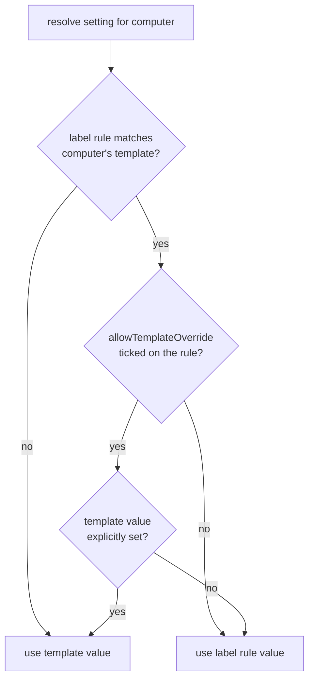

# Plan: Label-Based Hot Spare Scaling, Provisioning Grace Period, and Weighted Template Round-Robin

Target: `/workspace/queue-debugging/ec2-plugin` (branch `hot-spares-by-label`, based on `88a634a0`).

This plan supersedes `suggested-ec2-plan.md`. It keeps that document's intent (label-based hot
spares, per-label idle timeout override, JENKINS-23792 fix) and adds two new features:

- **Feature A — Provisioning grace period** for agents that never come online.
- **Feature B — Weighted round-robin across labeled templates**, mirroring the availability-zone
  round-robin merged in `9ec2584f` ("Improve multi-AZ provisioning by being capacity-aware").

`suggested-ec2.patch` is a loose reference only. Section 7 lists the specific defects in that
patch that must not be carried forward.

---

## 1. Verified current state

### 1.1 Template selection is first-match, not round-robin

`EC2Cloud.provision(Label, int)` walks matching templates in **configured order** and stops as
soon as the excess workload is satisfied:

```1089:1102:ec2-plugin/src/main/java/hudson/plugins/ec2/EC2Cloud.java
    public Collection<PlannedNode> provision(final Label label, int excessWorkload) {
        final Collection<SlaveTemplate> matchingTemplates = getTemplates(label);
        List<PlannedNode> plannedNodes = new ArrayList<>();
        // ...
        for (final SlaveTemplate t : matchingTemplates) {
```

`getTemplates(Label)` already implements the "homogeneous group" idea the feature request
describes — every template whose label set matches, honouring `NORMAL`/`EXCLUSIVE` mode:

```657:671:ec2-plugin/src/main/java/hudson/plugins/ec2/EC2Cloud.java
    public Collection<SlaveTemplate> getTemplates(Label label) {
        List<SlaveTemplate> matchingTemplates = new ArrayList<>();
        for (SlaveTemplate t : templates) {
            if (t.getMode() == Node.Mode.NORMAL) {
                if (label == null || label.matches(t.getLabelSet())) {
                    matchingTemplates.add(t);
                }
            } else if (t.getMode() == Node.Mode.EXCLUSIVE) {
                if (label != null && label.matches(t.getLabelSet())) {
                    matchingTemplates.add(t);
                }
            }
        }
        return matchingTemplates;
    }
```

Today the loop only advances to the next template when the **instance cap** check fails
(`possibleSlavesCount <= 0`). An AWS insufficient-capacity failure does *not* advance to the next
template: it is caught inside the async `CompletableFuture`, logged, and returns `null`, so the
`PlannedNode` fails and the queue waits for the next `NodeProvisioner` cycle. That is exactly the
slow path Feature B must eliminate.

### 1.2 The AZ round-robin pattern to mirror (commit `9ec2584f`)

Three pieces already exist in `SlaveTemplate` and should be reused conceptually at template-group
level:

1. **Rotating cursor with cooldown skip** — `chooseSubnetId()` advances `nextSubnet` and skips any
   subnet in a capacity cooldown:

```1754:1778:ec2-plugin/src/main/java/hudson/plugins/ec2/SlaveTemplate.java
    public String chooseSubnetId() {
        if (subnetId == null || subnetId.isBlank()) {
            return null;
        } else {
            String[] subnetIdList = getSubnetId().split(EC2_RESOURCE_ID_DELIMETERS);

            // Round-robin subnet selection, skipping any subnet currently in a capacity
            // cooldown (i.e. one that recently reported insufficient capacity for this
            // template's instance type).
            for (int i = 0; i < subnetIdList.length; i++) {
                String candidate = subnetIdList[nextSubnet];
                nextSubnet = (nextSubnet + 1) % subnetIdList.length;
                if (!isSubnetInCooldown(candidate)) {
                    currentSubnetId = candidate;
                    return currentSubnetId;
                }
            }

            // Every subnet is currently cooling down. Rather than refuse to provision,
            // fall back to plain round-robin so we still attempt a launch.
            currentSubnetId = subnetIdList[nextSubnet];
            nextSubnet = (nextSubnet + 1) % subnetIdList.length;
            return currentSubnetId;
        }
    }
```

2. **Cooldown bookkeeping** — `subnetCapacityCooldownUntil` (transient `ConcurrentHashMap`),
   `markSubnetUnavailable()`, `isSubnetInCooldown()`, a test-overridable `Clock`, and a
   `SUBNET_CAPACITY_COOLDOWN_MILLIS` system property defaulting to 5 minutes
   (`SlaveTemplate.java` lines 158–188 and 1798–1864).

3. **Immediate in-request failover** — `runOndemandInstancesWithSubnetFailover()` retries
   `runInstances` against the next subnet on an insufficient-capacity error, and rethrows once all
   subnets are exhausted (`SlaveTemplate.java` lines 2591–2645). The classifier is:

```1862:1864:ec2-plugin/src/main/java/hudson/plugins/ec2/SlaveTemplate.java
    static boolean isInsufficientCapacityError(String errorCode) {
        return errorCode != null && INSUFFICIENT_CAPACITY_ERROR_CODES.contains(errorCode);
    }
```

Feature B is the same three-part structure applied one level up: rotate over templates in a label
group, cool down a template that reports insufficient capacity, and fail over to the next template
inside the same provisioning request.

### 1.3 Idle timeout is measured from EC2 launch time, not agent readiness

```247:262:ec2-plugin/src/main/java/hudson/plugins/ec2/EC2RetentionStrategy.java
            final long idleMilliseconds =
                    this.clock.millis() - Math.max(computer.getIdleStartMilliseconds(), launchedAt.toEpochMilli());

            if (idleTerminationMinutes > 0) {
                // TODO: really think about the right strategy here, see
                // JENKINS-23792
```

`launchedAt` is `computer.getLaunchTime()`, i.e. the EC2 `Instance.launchTime()`. Slow user-data
or init scripts therefore burn idle-timeout budget before the agent is usable. This is
JENKINS-23792, and the stale `TODO` comment must be replaced as part of the fix.

### 1.4 There is no reliable "never came online" handling

- The only existing guard is the per-template launch timeout, and it fires **only** while
  `computer.isConnecting()` is true (`EC2RetentionStrategy.java` lines 215–238). A computer that
  is offline and not connecting falls through to the idle math.
- `SlaveTemplate.launchTimeout` defaults to `Integer.MAX_VALUE` when `launchTimeoutStr` is unset
  or unparsable (`SlaveTemplate.java` lines 450–454), so out of the box there is effectively no
  timeout.
- `internalCheck()` returns immediately when `idleTerminationMinutes == 0`, so a template
  configured to never idle-terminate also never gets any never-came-online handling.

### 1.5 `getLastSuccessfulLoginTime()` does not exist

`suggested-ec2.patch` guards the idle check with `computer.getLastSuccessfulLoginTime()`. No such
method exists on `EC2Computer`, `EC2AbstractSlave`, or `SlaveComputer` in this codebase. What does
exist:

- `EC2ComputerListener.onOnline(Computer, TaskListener)` → `EC2Computer.onConnected()` →
  `EC2AbstractSlave.onConnected()`, which today only sets `isConnected = true`
  (`EC2AbstractSlave.java` lines 896–901).
- `Computer#getConnectTime()` from Jenkins core, set when the agent channel is established.

The plan uses `onConnected()` as the recording point and `getConnectTime()` as a fallback for
nodes that were already online across a controller restart.

### 1.6 Hot spares today are per-template and counted by template description

`MinimumInstanceChecker` groups agents by `template.description` equality:

```57:70:ec2-plugin/src/main/java/hudson/plugins/ec2/util/MinimumInstanceChecker.java
    private static Stream<EC2Computer> agentsForTemplate(@NonNull SlaveTemplate agentTemplate) {
        return Arrays.stream(Jenkins.get().getComputers())
                .filter(EC2Computer.class::isInstance)
                .map(EC2Computer.class::cast)
                .filter(computer -> {
                    SlaveTemplate computerTemplate = computer.getSlaveTemplate();
                    return computerTemplate != null
                            && Objects.equals(computerTemplate.description, agentTemplate.description);
                });
    }
```

Label-based counting needs a parallel path that aggregates across every template in a label group.
`checkForMinimumInstances()` is already `synchronized` for JENKINS-76171 and already has an async
`scheduleCheck()` entry point plus a single-threaded executor — label scaling should live here
rather than in a separate periodic task (see §4.4).

### 1.7 `SlaveTemplate` has ~15 deprecated constructors

`minimumNumberOfSpareInstances` is a `final` field threaded through every one of them
(`SlaveTemplate.java` lines 248, 365, 442, 508, 554, 603, 648, …). **All new `SlaveTemplate`
fields in this plan must be non-final with `@DataBoundSetter`**, never new constructor parameters.

---

## 2. Feature A — Provisioning grace period

### 2.1 Behaviour

A grace period starts when provisioning is **requested** (node object created), not when EC2
reports the instance as launched. If the agent has not come online by the deadline, one of two
things happens based on a checkbox:

| `discardAfterGracePeriod` | Behaviour at expiry |
|---|---|
| checked (default) | Terminate the instance immediately, logged distinctly from launch timeout |
| unchecked | Start the idle-timeout clock from the grace deadline; normal idle termination follows |

The unchecked variant is what makes the setting a *grace period* rather than a second launch
timeout: a slow-booting agent that is still expected to arrive gets the full idle window after the
grace deadline instead of being killed outright.

### 2.2 Timestamps to add

Add to `EC2AbstractSlave`, both `transient` (best-effort, need not survive a restart):

```java
/** Epoch millis when this node object was created, i.e. when provisioning was requested. */
private transient volatile long provisionRequestedAtMillis;

/** Epoch millis when the agent channel first came up, or 0 if it never has. */
private transient volatile long onlineSinceMillis;
```

- `provisionRequestedAtMillis` is set in the primary `EC2AbstractSlave` constructor (the one all
  the deprecated overloads delegate to) and re-seeded in `readResolve()` for nodes restored from
  disk.
- `onlineSinceMillis` is set in `onConnected()`, which already runs from
  `EC2ComputerListener.onOnline`. Keep the existing `isConnected = true` assignment.

Expose on `EC2Computer`:

```java
/** @return epoch millis when the agent came online, or {@code 0} if it never has. */
public long getOnlineSinceMillis()   // node value, falling back to Computer#getConnectTime()

/** @return epoch millis when provisioning was requested. */
public long getProvisionRequestedAtMillis()
```

The `getConnectTime()` fallback matters after a controller restart: the node is reloaded, the
transient field is 0, but the channel may already be up.

### 2.3 Configuration surface

Two new settings on `SlaveTemplate`, both `@DataBoundSetter` (never constructor params, see §1.7):

- `gracePeriodMinutes` (`int`, default `0` = disabled, so upgrades keep current behaviour)
- `discardAfterGracePeriod` (`boolean`, default `true`)

Both go in the `<f:advanced>` block of `SlaveTemplate/config.jelly` immediately after
`minimumNumberOfSpareInstances` (line 157), so all the hot-spare knobs sit together.

`HotSpareConfigByLabel` (§3.1) carries the same two fields, plus the override checkboxes described
in §2.4.

### 2.4 Precedence: label rule vs template

Idle timeout and grace period share one resolution shape, so the two settings behave identically
on the config screen.

**Default: the label rule wins.** This is the behaviour specified in `suggested-ec2-plan.md`
("overrides cloud-template idle timeout as required") and now applies to the grace period too.

**Opt-in template override.** `HotSpareConfigByLabel` gets two checkboxes in its own
`<f:advanced>` block, both defaulting to `false`:

- `allowTemplateIdleTimeoutOverride`
- `allowTemplateGracePeriodOverride`

When a checkbox is ticked, a template that has **explicitly set** the corresponding value wins over
the label rule. A template that has not set it still falls back to the label rule. Without the
"explicitly set" qualifier the override would be useless: every default template would beat the
label rule with its own unset value and the label setting would become dead config.

"Explicitly set" per field:

- Idle timeout: `SlaveTemplate.idleTerminationMinutes` is a `String`, so blank or `null` means
  unset. This gives a clean tri-state without any new field. Note that
  `EC2RetentionStrategy`'s own `idleTerminationMinutes` already collapses blank to `0`
  (constructor, lines 84–98), so the resolver must read the template string, not the strategy
  field.
- Grace period: `gracePeriodMinutes != 0`.

`discardAfterGracePeriod` is a plain `boolean` and cannot express "unset", so it does not get its
own precedence rule: **it travels with whichever `gracePeriodMinutes` value won.** If the template's
grace period is selected, the template's discard flag applies; if the label rule's is selected, the
label rule's flag applies. This avoids a tri-state `Boolean` and keeps each grace-period
configuration internally consistent.

Resolution order, evaluated per computer:



Resolvers on `EC2Cloud`:

```java
/** Effective idle termination in minutes, or {@code null} to use the retention strategy value. */
@CheckForNull
public Integer resolveIdleTerminationMinutes(@NonNull EC2Computer computer)

/** Effective grace period for a computer, in minutes; 0 means disabled. */
public int resolveGracePeriodMinutes(@NonNull EC2Computer computer)

/**
 * Whether grace-period expiry should terminate rather than start the idle clock. Reflects the
 * same source (template or label rule) that supplied the effective grace period.
 */
public boolean resolveDiscardAfterGracePeriod(@NonNull EC2Computer computer)
```

### 2.5 `EC2RetentionStrategy` changes

Three edits, in order:

**(a) Move the `idleTerminationMinutes == 0` early return.** It currently short-circuits before
any label override or grace check can run:

```151:157:ec2-plugin/src/main/java/hudson/plugins/ec2/EC2RetentionStrategy.java
    private long internalCheck(EC2Computer computer) {
        /*
         * If we've been told never to terminate, or node is null(deleted), no checks to perform
         */
        if (idleTerminationMinutes == 0 || computer.getNode() == null) {
            return CHECK_INTERVAL_MINUTES;
        }
```

Replace with a `getNode() == null` guard, then resolve `effectiveIdleMinutes` and
`effectiveGraceMinutes`, and return early only when **both** are disabled. A template with
`idleTerminationMinutes = 0` must still honour a label-configured idle timeout and a grace period.

**(b) Add the grace-period check before the offline/connecting branch** (currently lines 215–245),
so it applies whether or not the launcher is mid-connect:

```java
final int graceMinutes = effectiveGraceMinutes;
if (graceMinutes > 0 && computer.getOnlineSinceMillis() == 0) {
    long graceDeadline = computer.getProvisionRequestedAtMillis()
            + TimeUnit.MINUTES.toMillis(graceMinutes);
    if (this.clock.millis() > graceDeadline) {
        if (discardAfterGrace) {
            // Terminate: the agent never came online within the grace period.
            EC2AbstractSlave node = computer.getNode();
            if (node != null) {
                Queue.withLock(node::graceTimeout);
            }
            return CHECK_INTERVAL_MINUTES;
        }
        // Otherwise fall through: idleBaseline below becomes graceDeadline, so the
        // idle clock starts now rather than at EC2 launch time.
    } else {
        return CHECK_INTERVAL_MINUTES; // still inside the grace period
    }
}
```

Add `EC2AbstractSlave.graceTimeout()` next to the existing `idleTimeout()`/`launchTimeout()` pair
(lines 820–832) so the log line names the real cause:

```java
void graceTimeout() {
    LOGGER.info("EC2 instance never came online within the grace period: " + getInstanceId());
    terminate();
}
```

**(c) Fix the idle baseline (JENKINS-23792) and use the effective timeout.** Replace the
`launchedAt`-based baseline and delete the stale `TODO`:

```java
// Idle time is measured from the moment the agent became usable, not from when the EC2
// instance was launched: slow user-data or init scripts must not consume the idle budget.
// See JENKINS-23792. When the agent never came online and the grace period has expired
// without discarding, the grace deadline is the baseline instead.
long readyAt = computer.getOnlineSinceMillis();
if (readyAt == 0) {
    readyAt = computer.getProvisionRequestedAtMillis()
            + TimeUnit.MINUTES.toMillis(graceMinutes);
}
final long idleMilliseconds =
        this.clock.millis() - Math.max(computer.getIdleStartMilliseconds(), readyAt);

if (effectiveIdleMinutes > 0) {
    // ...
    if (idleMilliseconds > TimeUnit.MINUTES.toMillis(effectiveIdleMinutes) && !queueHasItemsForSlave) {
```

The same `effectiveIdleMinutes` substitution applies to the negative-value billing-hour branch
(lines 275–308), which uses `Math.abs(idleTerminationMinutes)`.

### 2.6 Interaction with the existing launch timeout

`SlaveTemplate.launchTimeoutStr` stays as-is. Documented precedence: both timers run
independently and **whichever expires first wins**. The launch timeout is measured from EC2
`uptime` and always terminates; the grace period is measured from the provisioning request and may
either terminate or hand off to the idle clock. The help text for `gracePeriodMinutes` must state
this explicitly so admins do not set a grace period expecting it to extend a shorter launch
timeout.

---

## 3. Label-based hot spare configuration (from the original plan, corrected)

### 3.1 `HotSpareConfigByLabel` must be a `Describable`

A plain `Serializable` inner class cannot be bound by `<f:repeatable field="...">`. It has to be a
top-level (or nested static) `AbstractDescribableImpl` with a `@DataBoundConstructor` and a
registered `Descriptor`:

```java
public class HotSpareConfigByLabel extends AbstractDescribableImpl<HotSpareConfigByLabel>
        implements Serializable {

    private final String label;
    private int scalingFactor = 5;
    private int baseHotSpares = 0;
    private Integer maxHotSpares;              // null = unlimited; caps the whole label group
    private int idleTimeoutMinutes = 15;
    private int gracePeriodMinutes = 0;        // Feature A
    private boolean discardAfterGracePeriod = true;

    // Advanced: opt-in template precedence, see 2.4
    private boolean allowTemplateIdleTimeoutOverride = false;
    private boolean allowTemplateGracePeriodOverride = false;

    @DataBoundConstructor
    public HotSpareConfigByLabel(String label) { this.label = Util.fixEmptyAndTrim(label); }

    // @DataBoundSetter for each mutable field, plus getters

    @Extension
    @Symbol("hotSpareConfigByLabel")
    public static class DescriptorImpl extends Descriptor<HotSpareConfigByLabel> {
        @Override public String getDisplayName() { return "Hot Spare Rule"; }

        @POST public FormValidation doCheckLabel(@QueryParameter String value) { /* ... */ }
        @POST public FormValidation doCheckScalingFactor(@QueryParameter String value) { /* ... */ }
        @POST public FormValidation doCheckMaxHotSpares(@QueryParameter String value) { /* ... */ }
    }
}
```

`baseHotSpares` is new relative to the original plan and is required: see §4.5.

`maxHotSpares` caps the **total** spares across every template in the label group, not each
template individually. That follows from treating the group as homogeneous: the admin is capping
how much idle hardware the label may hold, regardless of which instance types supply it.

The two `allowTemplate*Override` checkboxes go in an `<f:advanced>` block inside
`HotSpareConfigByLabel/config.jelly`, keeping the common case (label rule wins) as the only
visible behaviour by default.

### 3.2 `EC2Cloud` wiring

- Field `private List<HotSpareConfigByLabel> hotSpareConfigsByLabel = new ArrayList<>();`
- Plain getter + `@DataBoundSetter`. There is **no** `@DataBoundGetter` in Stapler; the patch's use
  of it is invalid.
- Null-initialise in `readResolve()` alongside the existing `cachedTemplateSlaves` guard
  (`EC2Cloud.java` lines 505–513), so configs saved by an older version load cleanly.
- Resolver, keyed on the computer's **assigned labels**, not its self label:

```java
/**
 * @return the hot spare rule that applies to this computer, or {@code null} if none does.
 *     A computer matches a rule when the rule's label is in the label set of the computer's
 *     template — the same homogeneity test used by {@link #getTemplates(Label)}.
 */
@CheckForNull
public HotSpareConfigByLabel getHotSpareConfigFor(@NonNull EC2Computer computer)

/** @return the label-configured idle timeout in minutes, or {@code null} if no rule matches. */
@CheckForNull
public Integer getIdleTerminationForLabel(@NonNull String label)
```

plus the three precedence-aware resolvers from §2.4, which are what `EC2RetentionStrategy`
actually calls.

### 3.3 Label dropdown source

Per the answered question in the original plan: populate only from labels known to **this cloud**,
i.e. the union of `template.getLabelSet()` across `getTemplates()`. Implement as
`doFillLabelItems()` on the `HotSpareConfigByLabel` descriptor using `@AncestorInPath EC2Cloud`,
with `includeCurrentValue` so a label that was removed from all templates still round-trips
instead of silently clearing on save.

### 3.4 Precedence over template-level hot spares

When a label rule matches a template's label set, that template's `minimumNumberOfSpareInstances`
is ignored for the labelled group and the rule's numbers apply. `minimumNumberOfInstances` is
**not** overridden — it remains the per-template floor, and the min-instance protection in
`internalCheck()` (lines 162–173) stays in force. This differs from `suggested-ec2.patch`, which
disables that protection whenever a label timeout exists; doing so lets a label rule terminate
instances below an admin's explicit template floor.

`SlaveTemplate/config.jelly` gets an inline note next to `minimumNumberOfSpareInstances` stating
that the field is ignored when a cloud-level hot spare rule matches the template's labels.

Note the distinction from §2.4: `minimumNumberOfSpareInstances` is **unconditionally** superseded
by a matching rule (there is no opt-out checkbox for it, because the whole point of the rule is to
own the spare count for the group). The two settings that *do* get opt-in template precedence are
idle timeout and grace period.

---

## 4. Feature B — Weighted round-robin across labeled templates

> **Opt-in.** All rotation behaviour in this section is gated behind a new cloud-level checkbox,
> `EC2Cloud.roundRobinTemplatesByLabel`, defaulting to `false`. With the box unticked, template
> selection keeps today's configured-order semantics exactly. See §4.6 for the flag, what it does
> and does not gate, and the reasoning.

### 4.1 `SlaveTemplate.hotSpareWeight`

New field, `@DataBoundSetter`, `int`, default `1`. Placed in `SlaveTemplate/config.jelly`
immediately after `minimumNumberOfSpareInstances` (i.e. alongside the hot spare configuration, as
requested) with `help-hotSpareWeight.html`:

> Relative weight used when several templates in this cloud match the same label. Requires
> "Round-robin templates matching the same label" to be enabled on the cloud; without it,
> templates are tried in configured order and this weight is ignored.
>
> When rotation is enabled, Jenkins treats all templates matching a label as interchangeable
> hardware and rotates between them so an instance for that label provisions as fast as possible.
> A template with a higher weight is chosen proportionally more often — for example, weight 3 on a
> spot template and weight 1 on an equivalent on-demand template attempts spot three times as
> often, while still falling back to on-demand immediately if spot capacity is unavailable. The
> default of 1 gives plain round-robin. A weight of 0 excludes the template from normal rotation;
> it is only used when every other template in the group is in a capacity cooldown. This setting
> affects provisioning from hot spares by label as well as ordinary label-driven provisioning.

Validation: `doCheckHotSpareWeight` rejects negatives and clamps on read. It should additionally
return `FormValidation.warning(...)` when the value is not 1 while
`roundRobinTemplatesByLabel` is disabled on the parent cloud (reachable via
`@AncestorInPath EC2Cloud`), so an admin is told the weight is currently inert rather than
discovering it silently does nothing.

### 4.2 New `LabelTemplateRotation` helper

A new class (suggested: `hudson/plugins/ec2/LabelTemplateRotation.java`, package-private or
`@Restricted(NoExternalUse.class)`) owned by `EC2Cloud` as a transient field, holding:

- `ConcurrentHashMap<String /*label*/, int[] /*current weights*/>` — smooth weighted round-robin
  state.
- `ConcurrentHashMap<String /*template description*/, Long>` — capacity cooldown deadlines,
  directly mirroring `subnetCapacityCooldownUntil`.
- A test-overridable `Clock`, mirroring `SlaveTemplate.setClock()`.
- `TEMPLATE_CAPACITY_COOLDOWN_MILLIS` from
  `SystemProperties.getLong(LabelTemplateRotation.class.getName() + ".templateCapacityCooldownMillis", TimeUnit.MINUTES.toMillis(5))`
  — a **separate** property from `SlaveTemplate.subnetCapacityCooldownMillis`, with the same
  5-minute default so the two layers behave alike out of the box but can be tuned independently.

**Single-template groups bypass the cooldown entirely.** When only one template matches a label
there is nothing to fail over to, so cooling it down would stall provisioning for that label for
five minutes and, worse, would suppress the per-template AZ rotation that
`runOndemandInstancesWithSubnetFailover()` already performs. Concretely:

- `markTemplateUnavailable(t)` is a no-op when the template's label group has size 1.
- `isTemplateInCooldown(t)` returns `false` for a single-template group.

The practical effect is that a label backed by one template keeps retrying across its
availability zones exactly as it does today, and the new cooldown only engages once an admin has
given a label two or more interchangeable templates.

Because group size is a property of the label being provisioned rather than of the template alone,
the size check belongs in `order(...)` and in the failover path in §4.3, both of which already
know the matching collection. `markTemplateUnavailable` should therefore take the group size (or
the matching collection) as a parameter rather than deriving it.

Public surface:

```java
/**
 * Orders the templates matching a label for provisioning. Templates are treated as homogeneous
 * (interchangeable instance types the admin has given the same label) and returned in smooth
 * weighted round-robin order, with any template currently in a capacity cooldown moved to the
 * end rather than dropped, so a launch is still attempted if every template is cooling down.
 */
List<SlaveTemplate> order(String labelName, Collection<SlaveTemplate> matching);

/**
 * Marks a template as capacity-unavailable. No-op when {@code groupSize <= 1}: a label with a
 * single template has nothing to fail over to, so it must keep retrying across its own
 * availability zones rather than being taken out of rotation.
 */
void markTemplateUnavailable(SlaveTemplate t, int groupSize);

boolean isTemplateInCooldown(SlaveTemplate t, int groupSize);
```

**Use smooth weighted round-robin (nginx-style), not list expansion.** For each candidate,
`current[i] += weight[i]`; select `argmax(current)`; then `current[selected] -= totalWeight`. This
interleaves as `spot, spot, ondemand, spot, spot, ondemand` for weights 2/1, whereas expanding the
list to `[spot, spot, ondemand]` and rotating produces the same *ratio* but bursts consecutive
picks of one type, which defeats the fast-fallback goal when spot capacity is gone.

Cooled-down templates are **demoted, not removed** — the same "rather than refuse to provision,
fall back" reasoning as `chooseSubnetId()`.

### 4.3 `EC2Cloud.provision(Label, int)` rework

- Replace `for (final SlaveTemplate t : matchingTemplates)` with a loop over the resolved
  `ordered` list from §4.6 — the rotation when `roundRobinTemplatesByLabel` is enabled, the
  configured order otherwise. The rest of this subsection applies identically in both modes.
- Keep the existing per-template instance-cap check and `continue`-to-next-template behaviour.
- **Hoist capacity failures so they fail over synchronously.** Today the `SdkException` catch is
  inside the async supplier and returns `null`. Change the supplier to distinguish
  insufficient-capacity errors (via `SlaveTemplate.isInsufficientCapacityError`, which needs to
  become package-visible to `EC2Cloud` — it already is `static` package-private in the same
  package) from other failures. On a capacity error:
  1. `rotation.markTemplateUnavailable(t, matchingTemplates.size())`, which is a no-op for a
     single-template label group (§4.2),
  2. log at `INFO` in the style of the AZ failover message ("template X has insufficient capacity
     for instance type Y; trying next template"),
  3. attempt the next template in the rotation **within the same `provision()` call** rather than
     waiting for the next `NodeProvisioner` cycle.

  Structurally the cleanest form is to extract the body of the current supplier into
  `private List<EC2AbstractSlave> provisionFromGroup(List<SlaveTemplate> ordered, int startIndex, int number)`
  which loops over the ordered group, so the returned `CompletableFuture` resolves against
  whichever template actually succeeded. Note this changes which template a `PlannedNode`'s
  `displayName`/`numExecutors` refer to; since the group is homogeneous by definition, use the
  first candidate's values for the `PlannedNode` and let the actual node carry the real template
  description.
- `excessWorkload` accounting stays per-template because `getNumExecutors()` can legitimately
  differ across the group.

`canProvision(Label)` is unchanged — `!getTemplates(label).isEmpty()` is still correct.

### 4.4 Hot spare scaling lives in `MinimumInstanceChecker`, not a new monitor

The original plan proposed a separate `@Extension HotSpareScalingMonitor extends PeriodicWork`.
Do **not** add a second independent provisioning loop:

- `MinimumInstanceChecker.checkForMinimumInstances()` is `synchronized` specifically to stop
  concurrent provisioning decisions over-provisioning (JENKINS-76171). A parallel monitor would
  reintroduce that race.
- It already has an async entry point (`scheduleCheck()`), a dedicated single-thread executor, and
  callers in `EC2RetentionStrategy.taskAccepted` and `EC2SlaveMonitor`.

Instead:

1. Add `checkForLabelHotSpares()` to `MinimumInstanceChecker`, called from the same
   `synchronized` method after the per-template pass, and extend the early-exit predicate
   (currently `minimumNumberOfInstances > 0 || minimumNumberOfSpareInstances > 0`) to also return
   early only when no cloud has any `hotSpareConfigsByLabel` entries.
2. Add label-group counting helpers next to `agentsForTemplate`:
   `agentsForLabel(EC2Cloud, String)`, `countCurrentNumberOfSpareAgentsForLabel`,
   `countCurrentNumberOfProvisioningAgentsForLabel`, `countQueueItemsForLabel` — aggregating over
   every template in `cloud.getTemplates(Label.get(labelName))` rather than matching a single
   `description`.
3. Add a thin `@Extension PeriodicWork` (1 minute, matching `EC2ConnectionUpdater`) whose `doRun()`
   only calls `MinimumInstanceChecker.scheduleCheck()`. All decisions stay in one synchronized
   place.
4. Provision through `LabelTemplateRotation.order(...)` so hot spares honour the weights, which is
   what makes the `hotSpareWeight` help text true.

### 4.5 Desired-count formula

The patch computes `desired = scalingFactor * queuedBuilds` and only provisions when
`queuedBuilds > 0`. That means zero queued builds implies zero spares, which is the opposite of a
hot spare. Use:

```
desired  = max(baseHotSpares, scalingFactor * queuedBuildsForLabel)
desired  = min(desired, maxHotSpares)            // when maxHotSpares != null
toLaunch = desired - (currentSpares + currentProvisioning)
```

Mirroring the existing template formula (`MinimumInstanceChecker.java` lines 150–158), the
in-flight (`currentProvisioning`) count must be subtracted or every one-minute tick re-provisions
the same shortfall while instances are still booting.

Scale-down is unchanged from the original plan: no immediate termination, the label rule's
`idleTimeoutMinutes` drains the group naturally to `baseHotSpares`.

### 4.6 Cloud-level opt-in: `roundRobinTemplatesByLabel`

Rotation changes which template a label picks first, so it cannot be the default without silently
reordering existing installations (see §11.5). It is therefore gated on a new cloud-wide boolean:

- `EC2Cloud.roundRobinTemplatesByLabel`, `boolean`, `@DataBoundSetter`, **default `false`**.
- Rendered in `EC2Cloud/config-entries.jelly` inside the existing `<f:advanced>` block
  immediately after `noDelayProvisioning` (line 46), since both are cloud-wide provisioning
  behaviour toggles. Title: "Round-robin templates matching the same label".
- Help text explains that with the box unticked, templates matching a label are tried in
  configured order (the historical behaviour), and that ticking it treats all templates matching a
  label as interchangeable hardware and rotates between them honouring `hotSpareWeight`.

#### What the flag gates

| Behaviour | Flag off (default) | Flag on |
|---|---|---|
| Template ordering for a label | Configured order, as today | Smooth weighted round-robin (§4.2) |
| `SlaveTemplate.hotSpareWeight` | Ignored (form warns if set) | Honoured |
| Per-template capacity cooldown (§4.2) | **Not applied** | Applied, with the single-template bypass |
| Fallback to the next template on failure | **Applied** | Applied |
| Label hot spare provisioning order (§4.4) | Configured order | Weighted round-robin |

#### What the flag deliberately does *not* gate

**The cross-template fallback in §4.3 is unconditional.** This is the key design decision of this
section. The user-visible request was "gracefully and immediately falling back to other hardware
instance types that match a label so that instances matching a label provision as fast as
possible", and today an insufficient-capacity error is swallowed inside the async
`CompletableFuture`, returning `null` and costing a full `NodeProvisioner` cycle (§1.1). Fixing
that is a strict improvement that does **not** reorder anything: it only takes effect after a
template has already failed, and it walks down the same order the admin configured.

So with the flag off the behaviour is "configured order, with fallback" — precisely today's
ordering, but with the fallback extended to cover capacity errors and other failures rather than
only instance-cap exhaustion.

The **cooldown** is gated, however, and this is why: with a fixed order, cooling down template 1
for five minutes means template 2 is chosen first on subsequent requests, which *is* an ordering
change. With the flag off, a failing template is skipped for the current request only, so the next
request starts at template 1 again. That keeps the default fully deterministic.

#### Implementation shape

`EC2Cloud.provision(Label, int)` resolves the candidate order once, then shares a single loop:

```java
Collection<SlaveTemplate> matching = getTemplates(label);
List<SlaveTemplate> ordered = roundRobinTemplatesByLabel
        ? rotation.order(label == null ? "" : label.getName(), matching)
        : new ArrayList<>(matching);
```

Everything downstream (the cap check, the `continue`-to-next-template fallback, the capacity
failover) operates on `ordered` and is identical in both modes. `markTemplateUnavailable(...)`
and `isTemplateInCooldown(...)` short-circuit to no-op/`false` when the flag is off, alongside the
existing single-template bypass, so there is one code path rather than two.

The same resolution is used by the label hot spare provisioning in §4.4.

---

## 5. Files to change

| File | Action | Purpose |
|---|---|---|
| `EC2Cloud.java` | Modify | `hotSpareConfigsByLabel` field + getter/`@DataBoundSetter`, `roundRobinTemplatesByLabel` boolean + `@DataBoundSetter` (§4.6), `readResolve()` guard, `getHotSpareConfigFor`, `getIdleTerminationForLabel`, the three §2.4 precedence resolvers, transient `LabelTemplateRotation`, reworked `provision(Label, int)` with synchronous capacity failover |
| `EC2Cloud/config-entries.jelly` | Modify | `roundRobinTemplatesByLabel` checkbox in the `<f:advanced>` block after `noDelayProvisioning` |
| `EC2Cloud/help-roundRobinTemplatesByLabel.html` | **New** | Explains configured-order default vs weighted rotation |
| `HotSpareConfigByLabel.java` | **New** | Describable rule: label, `scalingFactor`, `baseHotSpares`, `maxHotSpares`, `idleTimeoutMinutes`, `gracePeriodMinutes`, `discardAfterGracePeriod`, `allowTemplateIdleTimeoutOverride`, `allowTemplateGracePeriodOverride`, descriptor with `doFillLabelItems` + validators |
| `LabelTemplateRotation.java` | **New** | Smooth weighted round-robin cursor, per-template capacity cooldown with single-template bypass, separate cooldown system property, test-overridable `Clock` |
| `SlaveTemplate.java` | Modify | `hotSpareWeight`, `gracePeriodMinutes`, `discardAfterGracePeriod` as `@DataBoundSetter` fields (no new constructor params); widen `isInsufficientCapacityError` visibility if needed |
| `EC2RetentionStrategy.java` | Modify | Effective idle/grace resolution, relocated early return, grace-period branch, JENKINS-23792 idle baseline, replace stale `TODO` |
| `EC2AbstractSlave.java` | Modify | `provisionRequestedAtMillis`, `onlineSinceMillis`, record in constructor/`readResolve`/`onConnected`, new `graceTimeout()` |
| `EC2Computer.java` | Modify | `getOnlineSinceMillis()` (with `getConnectTime()` fallback), `getProvisionRequestedAtMillis()` |
| `util/MinimumInstanceChecker.java` | Modify | Label-group counting helpers, `checkForLabelHotSpares()`, widened early-exit predicate |
| `EC2Cloud/config.jelly` | Modify | Hot spare rule `<f:repeatable field="hotSpareConfigsByLabel">` block |
| `EC2Cloud/help-hotSpareConfigsByLabel.html` | **New** | Explains label homogeneity and precedence over template hot spares |
| `HotSpareConfigByLabel/config.jelly` + `help-*.html` | **New** | Per-rule form, with the two `allowTemplate*Override` checkboxes in an `<f:advanced>` block, plus field help |
| `SlaveTemplate/config.jelly` | Modify | `hotSpareWeight`, `gracePeriodMinutes`, `discardAfterGracePeriod` next to `minimumNumberOfSpareInstances`; note that the field is ignored when a label rule matches |
| `SlaveTemplate/help-hotSpareWeight.html`, `help-gracePeriodMinutes.html`, `help-discardAfterGracePeriod.html` | **New** | Field help, including grace-vs-launch-timeout precedence |

---

## 6. Test plan

Existing harnesses to extend: `MockEC2Computer` (needs settable online/provision timestamps and a
settable `SlaveTemplate`), `EC2RetentionStrategyTest` (already drives `internalCheck` with
`Clock.fixed` and a `DirectExecutorService`), `EC2CloudTest`/`EC2CloudUnitTest`,
`TemplateLabelsTest`, `SlaveTemplateUnitTest`, `ConfigurationAsCodeTest`.

**Feature A**
- Grace period unexpired, never online → no termination.
- Grace expired, `discardAfterGracePeriod = true` → `graceTimeout()` terminates.
- Grace expired, `discardAfterGracePeriod = false` → no termination yet; after
  `gracePeriod + idleTimeout` → `idleTimeout()` fires.
- Template `idleTerminationMinutes = 0` with a grace period set → grace still enforced (regression
  guard for the relocated early return).
- Agent online with a slow init script → idle timer starts at `onlineSinceMillis`, not EC2
  `launchTime` (the JENKINS-23792 assertion).
- Grace period and a shorter `launchTimeoutStr` both set → launch timeout wins.
- Node reloaded from disk with channel already up → `getConnectTime()` fallback prevents a
  spurious grace expiry.

**Precedence (§2.4)** — one matrix per setting, idle timeout and grace period:
- Label rule matches, override checkbox unticked, template value set → label rule wins.
- Label rule matches, override checkbox ticked, template value set → template wins.
- Label rule matches, override checkbox ticked, template value unset → label rule wins (the
  regression guard against the override nullifying the rule).
- No label rule matches → template value used.
- `discardAfterGracePeriod` follows whichever grace period value won, asserted in both directions
  (template grace + template discard flag; label grace + label discard flag).
- Idle timeout "unset" detection reads the template's `idleTerminationMinutes` **string**, not the
  retention strategy's parsed `int`, so a blank template value with a ticked override still falls
  back to the label rule rather than resolving to 0.

**Feature B**
- Three templates sharing a label, all weight 1 → `order()` returns each first exactly once over
  three calls.
- Weights 3/1 → over 8 calls the higher-weight template leads 6 times, and picks interleave rather
  than bursting (assert the exact smooth-WRR sequence).
- Weight 0 → never first while any other template is available; selected when all others are in
  cooldown.
- `markTemplateUnavailable` → template demoted to the end of the order; after the cooldown elapses
  on an injected `Clock`, it returns to normal position.
- All templates in cooldown → `order()` still returns the full group (no empty result).
- **Single-template label group** → `markTemplateUnavailable(t, 1)` is a no-op and
  `isTemplateInCooldown(t, 1)` stays `false`, so repeated capacity errors never take the only
  template out of rotation and the existing AZ failover keeps running. Assert that two consecutive
  capacity failures still both attempt a launch.
- `provision(label, n)` where the first template raises `InsufficientInstanceCapacity` → the
  returned `PlannedNode` resolves from the second template within the same call, and the first is
  in cooldown afterwards.
- Non-capacity `Ec2Exception` → no cooldown, existing failure behaviour preserved.

**Label hot spares**
- Zero queued builds with `baseHotSpares = 2` → two spares provisioned (the bug in the patch's
  `queuedBuilds > 0` gate).
- `scalingFactor`/`maxHotSpares` clamping.
- In-flight provisioning subtracted → two consecutive ticks do not double-provision.
- Label rule idle timeout overrides the template value; template `minimumNumberOfInstances` floor
  is still respected.
- Spares counted across two templates sharing a label (not per `description`).
- `maxHotSpares` caps the group total: two templates sharing a label with `maxHotSpares = 3` never
  hold more than 3 spares combined.

**Round-trip**
- `ConfigurationAsCodeTest`: export/import of `hotSpareConfigsByLabel` and the new
  `SlaveTemplate` fields; add fixtures to the `configuration-as-code*.yml` test resources.
- Load a cloud config saved without any of the new fields → defaults applied, no NPE
  (`hotSpareConfigsByLabel` null guard in `readResolve()`).

---

## 7. Defects in `suggested-ec2.patch` not to carry forward

Compile-level:

1. `@DataBoundGetter` does not exist in Stapler. Use a plain getter with `@DataBoundSetter`.
2. `HotSpareConfigByLabel` as a plain `Serializable` class cannot be bound by
   `<f:repeatable field=...>`; it needs a `@DataBoundConstructor` and a `Descriptor`.
3. `HotSpareScalingMonitor` is a `static` nested class calling the instance method
   `findMatchingTemplate(...)`.
4. `Label nodeLabel = ec2Computer.getNode().getAssignedLabels();` — `getAssignedLabels()` returns
   `Set<LabelAtom>`.
5. `t.getLabelSet().contains(Label.get(labelName))` — `getLabelSet()` is `Set<LabelAtom>` and
   `Label.get()` returns `Label`; use `label.matches(t.getLabelSet())`, consistent with
   `getTemplates(Label)`.
6. `computer.getLastSuccessfulLoginTime()` does not exist (§1.5).
7. The `EC2Cloud/config.jelly` fragment is unbalanced — it closes `</f:section>` inside an
   `<f:entry>` and opens sections that were never opened. There is no `<f:section>` in that file
   today (it is 8 lines of `st:include` plus the templates repeatable).
8. Cosmetic: `Level.INFO` and `LOGGER.info` appear as markdown links in the patch text.

Logic-level:

9. `getIdleTerminationForLabel(computer.getNode().getSelfLabel().getName())` looks up the **self
   label**, which is the node name (e.g. `AMI description (i-0abc…)`), so it can never match a
   configured label. Match against the template's label set instead.
10. `desired = scalingFactor * queuedBuilds` with a `queuedBuilds > 0` provisioning gate means no
    pre-warmed spares at all when the queue is empty (§4.5).
11. In-flight provisioning is not subtracted from the current count, so every tick re-provisions
    the same shortfall.
12. Adding `&& labelIdleTimeout == null` to the min-instance guard lets a label rule terminate
    instances below a template's explicit `minimumNumberOfInstances` floor (§3.4).
13. The bootstrap guard `return CHECK_INTERVAL_MINUTES` when the agent is not yet online has no
    upper bound, so an agent that never comes online is never cleaned up — the exact gap Feature A
    closes.

---

## 8. Suggested implementation order

1. **Timestamps and JENKINS-23792.** `EC2AbstractSlave`/`EC2Computer` timestamps plus the
   `internalCheck` idle-baseline fix and `TODO` cleanup. Self-contained and independently
   valuable.
2. **Feature A grace period.** Template-level fields, `graceTimeout()`, relocated early return,
   grace branch, help text, tests.
3. **`LabelTemplateRotation` + `hotSpareWeight`.** Pure unit-testable selection logic with no
   provisioning changes yet.
4. **Feature B provisioning rework.** Wire the rotation into `provision(Label, int)` and add
   synchronous capacity failover across the label group.
5. **Label hot spare rules.** `HotSpareConfigByLabel`, `EC2Cloud` wiring,
   `MinimumInstanceChecker.checkForLabelHotSpares()`, the thin `PeriodicWork`, and the label-level
   overrides of idle timeout and grace period.
6. **UI, help HTML, and CasC fixtures** for everything above.

Steps 1–4 have no dependency on the label rules, so they can land and be validated before the new
configuration surface is introduced.

---

## 9. Resolved design decisions

1. **Grace period default: `0` (disabled).** Upgrades keep current behaviour; admins opt in.
2. **Grace period lives on both `SlaveTemplate` and the label rule.** Same for idle timeout.
3. **Precedence: the label rule wins by default, for both idle timeout and grace period.** Two
   opt-in checkboxes on the label rule (`allowTemplateIdleTimeoutOverride`,
   `allowTemplateGracePeriodOverride`, both under `<f:advanced>`) let an explicitly-set template
   value take precedence. `discardAfterGracePeriod` travels with the winning grace period rather
   than having its own rule. See §2.4.
4. **`hotSpareWeight` applies to both** hot spare provisioning and ordinary label-driven
   `provision(Label, …)`.
5. **Rotation is opt-in via a cloud-level checkbox** `roundRobinTemplatesByLabel`, default
   `false`. Unticked preserves today's configured-order selection exactly and makes
   `hotSpareWeight` inert; ticked enables weighted rotation and the per-template capacity
   cooldown. The cross-template *fallback* fix is unconditional in both modes because it only
   engages after a template has already failed and never reorders anything. See §4.6.
6. **Template capacity cooldown uses its own system property**, defaulting to 5 minutes to match
   the AZ cooldown, and is **bypassed for single-template label groups** so a lone template keeps
   retrying across its availability zones. See §4.2.
7. **`maxHotSpares` caps the label group total**, not each template in the group.

## 10. Post-implementation verification: template caps are a hard ceiling

### 10.1 The invariant

> A template's `instanceCap` is an absolute ceiling. Label-level numbers
> (`maxHotSpares`, `baseHotSpares`, `scalingFactor`, `hotSpareWeight`) may only ever **reduce**
> what is provisioned from a template, never raise it above that template's own cap.

Concretely, per the requested example: a template with `instanceCap = 1` must hold at most one
instance at any time, even when a matching hot spare rule asks for 10 and even when the rotation
selects that template repeatedly.

Caveat for test authors: `SlaveTemplate.readResolve()` rewrites a cap of zero to "no cap", so a
test must use a cap of 1 or more. A cap of 0 does **not** mean "never provision":

```3351:3353:ec2-plugin/src/main/java/hudson/plugins/ec2/SlaveTemplate.java
        if (instanceCap == 0) {
            instanceCap = Integer.MAX_VALUE;
        }
```

### 10.2 Existing enforcement points to re-verify

All three already exist and must still hold after the §4.3 rework:

- `EC2Cloud.getPossibleNewSlavesCount(SlaveTemplate)` (lines 1014–1043) returns
  `min(template.getInstanceCap() - templateCount, instanceCap - total)`, i.e. both the
  per-template and the cloud-wide cap.
- `EC2Cloud.getNewOrExistingAvailableSlave(...)` (lines 1055–1085) refuses when the count is
  `<= 0` and clamps `number` down to the available headroom. This is the path used by
  `MinimumInstanceChecker` via `provision(SlaveTemplate, int)`, so label hot spares inherit the
  clamp.
- `EC2Cloud.provision(Label, int)` (lines 1109–1152) checks headroom before building the
  `PlannedNode`s and re-checks inside the async supplier.

### 10.3 Hazards this plan introduces

Four ways the new code could breach the invariant. Each needs an explicit check.

**(a) Stale instance-count cache inside the group loop.** `getPossibleNewSlavesCount` reads a
cache with a 30-second TTL (`INSTANCE_COUNT_CACHE_TTL_MS`, default `30_000`), and
`invalidateInstanceCountCache()` currently runs in `provisionFuture.whenComplete(...)` — after the
whole supplier completes. Inside the new `provisionFromGroup` loop, template A launching does not
invalidate the cache before template B's headroom check, so the **cloud-wide** `instanceCap`
component is read stale and the group can collectively overshoot. Fix: invalidate, or locally
decrement the running totals, between iterations while still holding `slaveCountingLock`.

**(b) Dropped shortfall instead of redistribution.** Label scaling computes a single `toLaunch`
for the group (§4.5). Handing the whole amount to one template means
`getNewOrExistingAvailableSlave` silently clamps to that template's headroom and the remainder is
lost — the group under-provisions and the next tick repeats the mistake. The loop must walk the
rotation launching up to each template's headroom until `toLaunch` is satisfied or every template
is at cap.

**(c) A high weight must not consume the allocation of a capped template.** A weight-10 template
sitting at cap must yield to lower-weight templates in the same group rather than absorbing the
allocation and clamping it to zero.

**(d) Cap exhaustion is not a capacity error.** A template at cap must **not** be placed in the
§4.2 capacity cooldown. That cooldown exists for AWS `Insufficient*Capacity` responses; cap
headroom can free up the instant an instance terminates, far sooner than the 5-minute cooldown
would expire. Skip the template for the current round only.

### 10.4 Verification checks

1. **Single template, `instanceCap = 1`, hot spare rule with `maxHotSpares = 10`** → exactly one
   instance provisioned. Re-run the scaling tick several times and assert the count stays at 1
   with no additional `runInstances` calls.
2. **Same, driven through `provision(Label, excessWorkload)`** with an excess workload demanding
   several executors → still exactly one instance.
3. **Two templates sharing a label, caps 1 and 3, rule asks for 10** → total settles at 4, split
   1/3, and neither template exceeds its own cap.
4. **Template A at cap, template B with headroom** → the shortfall is provisioned from B rather
   than dropped (hazard (b)), and A is skipped without entering the capacity cooldown
   (hazard (d)).
5. **Weighted case** (requires `roundRobinTemplatesByLabel` enabled): A has
   `hotSpareWeight = 10` and is at cap, B has weight 1 with headroom → provisioning comes from B
   (hazard (c)). Repeat checks 3 and 4 with the flag off to confirm caps are enforced identically
   in configured-order mode.
6. **Cloud-level `instanceCap` lower than the sum of template caps** → the group total respects
   the cloud cap, exercising the cache-invalidation fix in hazard (a). Assert with the cache TTL
   left at its default so a stale read would actually fail the test.
7. **Both provisioning entry points**: repeat checks 1 and 3 through both
   `MinimumInstanceChecker` (label hot spares) and `EC2Cloud.provision(Label, int)` (queue-driven),
   since they reach the cap logic by different routes.
8. **Manual `doProvision` path** with a template at cap → the existing
   "Cloud or AMI instance cap would be exceeded" error is still returned.

Checks 1 and 3 are the direct answers to the stated requirement and should be written first.

## 11. Post-implementation verification: label round-robin works without hot spare rules

### 11.1 The invariant

> Template selection depends **only** on the cloud-level `roundRobinTemplatesByLabel` checkbox
> (§4.6), never on whether hot spare rules exist. With the box ticked and
> `hotSpareConfigsByLabel` completely empty, labels must still round-robin across matching
> templates honouring `hotSpareWeight`. With the box unticked, configured order must be preserved
> exactly, whether or not rules exist.
>
> Fallback to the next template when a provision cannot occur is unconditional in both modes.

The two features are independent: Feature B (§4.1–§4.3, §4.6) changes how `provision(Label, int)`
picks a template for *any* queue-driven request, while the hot spare rules (§3) are an additional
opt-in scaling source. An admin who ticks the rotation box but never opens the hot spare section
must still get weighted rotation and fast fallback across their labelled templates.

### 11.2 Why this is a live risk

Two places in this plan gate behaviour on `hotSpareConfigsByLabel` being non-empty, and it would
be an easy mistake to let the rotation inherit that gate:

- §4.4 widens the `MinimumInstanceChecker` early-exit predicate so it returns early when no cloud
  has any rules. That gate is correct for *scaling* and must not be extended to selection.
- §3.2's `getHotSpareConfigFor(...)` returns `null` when no rule matches. Code that reaches for
  the rotation via a rule object rather than via the label would silently degrade to
  today's first-match behaviour.

`LabelTemplateRotation` must therefore be reached from `provision(Label, int)` using only the
`roundRobinTemplatesByLabel` flag, the label, and the matching template collection — never via a
`HotSpareConfigByLabel` lookup. The weights come from `SlaveTemplate.hotSpareWeight`, which
defaults to `1` on every template, so ticking the box on an otherwise unconfigured cloud yields
plain round-robin with no rules present.

### 11.3 Every "provision cannot occur" reason must fall back

The fallback must not be limited to capacity errors, and applies in **both** modes of §4.6.
Required behaviour per cause:

- **Template or cloud instance cap reached** (`getPossibleNewSlavesCount(t) <= 0`) → advance to the
  next template, **no** cooldown (§10.3 hazard (d)). This is the existing behaviour from
  `05176793` "Fix provisioning fallback when first template exhausted (#2005)" and must not
  regress.
- **AWS insufficient-capacity error** (`isInsufficientCapacityError`) → advance in both modes.
  Mark unavailable only when `roundRobinTemplatesByLabel` is enabled, and subject to the
  single-template bypass in §4.2.
- **`t.provision(...)` returns `null` or an empty list** → advance. Today this produces a failed
  `PlannedNode` and a wait for the next `NodeProvisioner` cycle.
- **Other `SdkException` / `IOException`** → advance to the next template, but **no** cooldown,
  since the fault is not known to be capacity-related and may be template-independent (expired
  credentials, throttling). Log at `WARNING` as today. Only after every template in the group has
  failed should the request give up.
- **`RequestExpired` / `ExpiredToken`** → keep the existing `reconnectToEc2()` handling, then
  advance.

### 11.4 Verification checks

**Flag on, no hot spare rules configured** (`hotSpareConfigsByLabel` empty):

1. **Rotation.** Three templates sharing a label: three successive `provision(label, …)` calls
   start from a different template each time, cycling in order.
2. **Weights.** Two templates with `hotSpareWeight` 3 and 1: the ratio holds even though no hot
   spare rule exists, confirming the weight is read from the template and not from a rule.
3. **Cooldown.** A template that reports insufficient capacity is demoted for the cooldown
   window, then returns to normal position once an injected `Clock` advances past it.
4. **Rules on a *different* label** → provisioning for an unrelated label still rotates normally,
   proving rotation is keyed off the flag rather than rule presence.

**Flag off (default), ordering must be untouched:**

5. **Configured order preserved.** Three templates sharing a label, all healthy: every
   `provision(label, …)` call picks the *first* configured template, repeatedly. This is the
   central no-regression assertion.
6. **`hotSpareWeight` inert.** Same setup with weights 10 and 1 on templates 2 and 1: order is
   still 1, 2. The form validation warning from §4.1 is present.
7. **No cooldown persistence.** First template reports insufficient capacity → the request falls
   through to the second template, but the *next* request starts at the first template again
   rather than skipping it for five minutes (§4.6).
8. **Label hot spares also use configured order** when rules exist but the flag is off.

**Fallback, verified in both modes:**

9. **Cap fallback.** First template at its `instanceCap`, second with headroom → the agent is
   provisioned from the second within the same `provision()` call, and the first is not cooled
   down. This is the `05176793` regression guard.
10. **Capacity-error fallback.** First template raises `InsufficientInstanceCapacity` → second
    template supplies the node in the same call. Cooldown is applied only when the flag is on.
11. **Generic-error fallback.** First template raises a non-capacity `SdkException` → second
    template supplies the node, and the first is **not** cooled down in either mode.
12. **All templates fail** → `provision()` returns without throwing, matching current behaviour,
    and nothing is left half-registered in Jenkins.
13. **Single template on a label** → behaviour is byte-for-byte today's in both modes: no
    cooldown, AZ rotation inside the template still runs (§4.2).

**Regression suite:**

14. Re-run `TemplateLabelsTest`, `EC2CloudTest`, `EC2CloudUnitTest`, and `SlaveTemplateTest`
    **unchanged and unmodified**. Because the flag defaults off, any test that implicitly assumes
    the first configured template is chosen must still pass. A failure here is a genuine bug in
    the flag gating, not a test to update — which is the main practical benefit of making rotation
    opt-in.

### 11.5 Upgrade behaviour: none

With rotation behind `roundRobinTemplatesByLabel` (default `false`), upgrading changes nothing
about which template a label picks. The only behavioural difference for an existing configuration
is that fallback now also covers insufficient-capacity and other provisioning failures rather than
only instance-cap exhaustion (§4.6), which strictly reduces the time a build waits and never
changes the template chosen first.

The changelog entry therefore describes a new opt-in option plus a fallback fix, with no migration
note required. An admin who previously relied on configured order as a preference ranking (cheap
template first, expensive as backup) keeps that behaviour by leaving the box unticked. Note that
enabling rotation and using `hotSpareWeight` biases the ratio rather than reproducing strict
"always the first template unless it is exhausted", so weighting is not a substitute for the
default mode; an explicit ordered-preference-with-weights mode is out of scope.

## 12. Remaining risks

- **`PlannedNode` identity under cross-template failover (§4.3).** `provision(Label, int)` builds
  `PlannedNode`s from `t.getDisplayName()` and `t.getNumExecutors()` before the launch resolves.
  Once a request can fail over to a different template mid-flight, those values may describe a
  template other than the one that ultimately launched. The group is homogeneous by definition so
  the executor count should match, but if templates in a group have genuinely different
  `numExecutors`, `NodeProvisioner`'s workload accounting can drift. Worth deciding during
  implementation whether to warn on save when a label group has mismatched `numExecutors`.
- **`EC2RetentionStrategy.idleTerminationMinutes` is `final` and captured at node creation.** The
  §2.4 resolvers are evaluated per check, so live config changes do take effect, but the field
  remains as the no-label fallback. Confirm no other code path reads it expecting the effective
  value.
- **Cursor state is transient.** Both the rotation cursor and the cooldown map are in-memory, so a
  controller restart resets rotation to the first template. This matches the existing `nextSubnet`
  behaviour and is acceptable.
