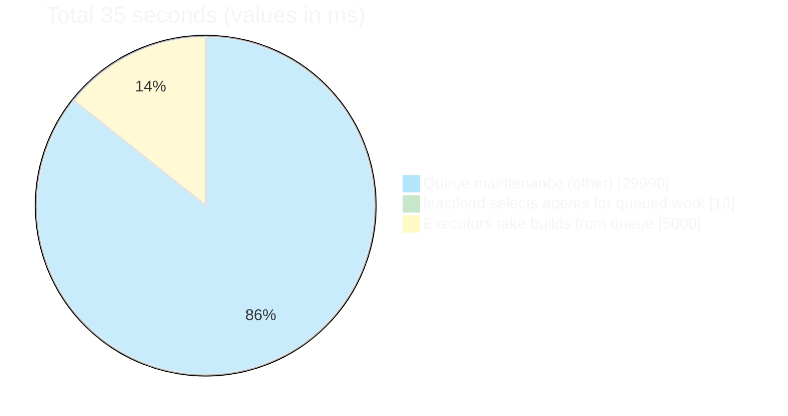

# Ludicrous Mode: Jenkins Queue Performance

A coordinated patch set across three Jenkins plugins that transforms Queue maintenance from a 30+ second blocking operation into a millisecond-fast non-blocking pipeline.

---

## Problem

Jenkins core runs a single-threaded `Queue.maintain()` loop under a global `ReentrantLock`. Every 5 seconds, this loop iterates over all buildable items, checks every candidate executor, and assigns work. Nothing else in Jenkins can schedule, cancel, or inspect the queue while this lock is held.

The real damage came from plugins hooking into this maintenance pipeline. The EC2 plugin made live AWS API calls (describeInstances, runInstances) while holding the Queue lock. The job-restrictions plugin evaluated regex and class-name restrictions on every (node, item) pair — and after XStream deserialization, silently threw NullPointerExceptions that Jenkins core interpreted as "block this item." The leastload plugin's round-robin logic returned null for label-restricted work when a single node had already been used, deferring the task to the next 5-second cycle.

Together, these plugins turned each `Queue.maintain()` cycle into a 30–35 second ordeal:

The leastload plugin itself took only ~10ms to select agents. The overwhelming majority of time was spent in plugin code making blocking API calls and evaluating restrictions under the Queue lock. The 5-second "Executors take builds from queue" slice represents the time executors waited for the lock to release before they could start their assigned work.

Because `Queue.maintain()` uses `scheduleWithFixedDelay`, the next cycle didn't start until 5 seconds *after* the previous 30-second cycle finished — meaning builds could wait 35+ seconds between scheduling attempts. With hundreds of buildable items and hundreds of agents, each cycle got slower, and the gap between cycles grew. Once Jenkins surpassed ~800 agents, Queue maintenance took so long that Jenkins itself became unresponsive — the UI hung, API calls timed out, and the system entered a death spiral where provisioning more agents made everything worse.

---

## Solution

The three plugin patches work together to ensure that everything called under the Queue lock returns in milliseconds. No AWS API calls, no expensive restriction evaluations, no blocking I/O — just fast in-memory lookups and instant returns.

### EC2 Plugin: Lightweight Queue Path, Heavyweight Background Work

The EC2 plugin's retention strategy (`check()`, `start()`) was called under the Queue lock and made live EC2 API calls for every agent. The patch splits all EC2 operations into two categories:

- **Lightweight** (runs under Queue lock): Returns immediately with no AWS interaction. Schedules heavy work on background thread pools and returns.
- **Heavyweight** (runs outside Queue lock): EC2 API calls (describeInstances, getState, connect), idle timeout, reconnect — all run on dedicated `HEAVY_WORK_EXECUTOR` and `PROVISIONING_EXECUTOR` thread pools.

Provisioning now returns `PlannedNode` futures immediately instead of blocking on `runInstances`. Instance counts are cached with a 30-second TTL to avoid repeated `describeInstances` calls. Dead-node detection uses batch `describeInstances` (one API call per cloud) instead of per-node calls. When agents come online, `scheduleMaintenance()` is called to trigger an immediate Queue re-evaluation rather than waiting for the next 5-second timer tick.

See [ec2-plugin/README.md](ec2-plugin/) for the full patch breakdown.

### Leastload Plugin: Pipeline Support and Immediate Label Assignment

The leastload plugin's load balancer is called for every buildable item during `Queue.maintain()`. Two bugs caused it to return null (deferring work to the next cycle) far more often than necessary:

1. **Pipeline tasks were ignored.** The plugin checked `subTask instanceof Job`, but pipeline work uses `PlaceholderTask` with a `Run` owner. All pipeline `node('label')` blocks fell back to the default consistent-hash balancer, bypassing least-load distribution entirely.

2. **Label-restricted work was deferred.** When a single node had the required label and was marked "used" by the round-robin tracker, the plugin returned null even when that node had idle executors. This caused 10–60+ second delays for label-restricted work.

The patch fixes both: pipeline tasks are resolved to their parent `Job` via `Run.getParent()`, and label-restricted work is assigned immediately when idle executors exist — even if the node was already used this round. Per-label round-robin tracking ensures high-demand labels aren't starved by a global round shared with other labels. Load prediction is disabled (returns empty) to skip the O(computers × predictors × FutureLoads) overhead per buildable item.

See [leastload-plugin/README.md](leastload-plugin/) for the full patch breakdown.

### Job-Restrictions Plugin: Cached Restriction Evaluation

The job-restrictions plugin evaluates regex patterns and class-name checks during `Node.canTake()`, which is called for every (node, item) pair during Queue maintenance. With hundreds of items and hundreds of nodes, this runs tens of thousands of times per cycle.

The patch adds a TTL cache so that repeated checks for the same (node, item) pair return instantly from the cache instead of re-evaluating restrictions. Only "allow" results are cached (never "block") to avoid stale blockages. The cache key includes both the item ID and the task's full display name to prevent collisions when pipeline flyweight tasks reuse queue item IDs.

Critically, the cache's `ConcurrentHashMap` is declared `transient volatile` with lazy double-checked-locking initialization. This fixes a silent bug where XStream deserialization (which bypasses constructors and field initializers) left the map `null`. The resulting `NullPointerException` was caught by Jenkins core's `Node.canTake()` and silently treated as "block this item" — permanently preventing all items from being dispatched to any node with job restrictions configured. This single bug was the root cause of the "Waiting for next available executor" hang that started this investigation.

See [job-restrictions-plugin/README.md](job-restrictions-plugin/) for the full patch breakdown.

---

## Results

With all three patches applied:

- **Queue maintenance completes in milliseconds** instead of 30+ seconds. All plugin code under the Queue lock performs only in-memory lookups and instant returns.
- **Jenkins remains responsive** at scale. The UI, API, and build scheduling all function normally because the Queue lock is held for trivial durations.
- **No performance cliff at 800+ agents.** Previously, Jenkins became unresponsive once agent count exceeded ~800 because each Queue maintenance cycle grew linearly with agent count (due to per-agent API calls under the lock). With the patches, agent count has minimal impact on Queue lock hold time.
- **Real-world pressure testing** was performed with over 1,000 AWS Jenkins agents with Jenkins remaining responsive and Queue maintenance staying fast.
- **Hypothetical scaling** into tens of thousands of agents is now feasible, since the Queue maintenance path no longer makes any network calls or expensive computations under the lock.

---

## Plugin Patch Details

Each plugin subfolder has a README summarizing the actual Java patches (diffed against `origin/master`) with references to background analysis:

- **[ec2-plugin/](ec2-plugin/)** — 8 files, +470/-185 lines. Async retention, async provisioning, instance count cache, batch describeInstances, queue maintenance triggers.
- **[leastload-plugin/](leastload-plugin/)** — 1 file, +203/-38 lines. Pipeline support, per-label round-robin, single-node immediate assign, load prediction skip.
- **[job-restrictions-plugin/](job-restrictions-plugin/)** — 7 files, +141/-47 lines. canTake TTL cache, transient volatile fix for XStream deserialization.
- **[jenkins/](jenkins/)** — Jenkins core Queue analysis (no code changes). Queue lock contention, MappingWorksheet performance, queue time breakdown pie chart.

---

## Configuration

All optimizations are configurable via system properties:

| Property | Default | Plugin | Description |
|----------|---------|--------|-------------|
| `jenkins.ec2.checkIntervalMinutes` | 1 | ec2 | Minutes between retention checks |
| `jenkins.ec2.instanceCountCacheTtlMs` | 30000 | ec2 | Instance count cache TTL |
| `jenkins.ec2.scheduleMaintenanceDelayMs` | 1000 | ec2 | Delay before queue maintenance on early provisioning events |
| `hudson.plugins.ec2.EC2Computer.instanceCacheTTLMs` | 30000 | ec2 | SSH verification state cache TTL |
| `JobRestrictionProperty.cacheDisabled` | false | job-restrictions | Disable canTake cache |
| `JobRestrictionProperty.cacheTtlMs` | 30000 | job-restrictions | canTake cache TTL |
| `JobRestrictionProperty.cacheMaxEntries` | 500 | job-restrictions | Max cache entries per node |
| `hudson.model.Queue.maintainInterval` | 5000 | jenkins core | Queue maintenance interval (ms) |
