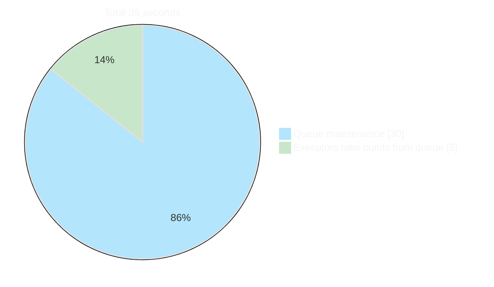
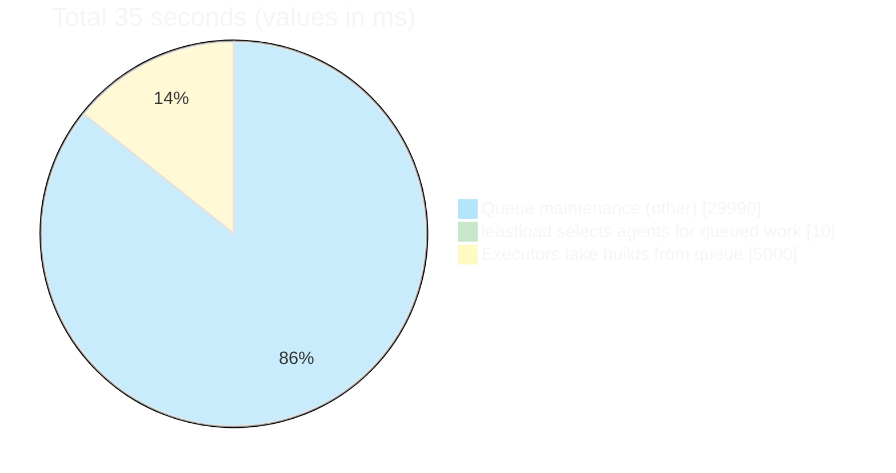

# Queue time breakdown (35 seconds total)

## Option A — Two slices (main view)

## Option B — All three in one chart (10 ms visible)

Values in milliseconds so the 10 ms slice is visible:

*(30 s = 30 000 ms; 10 ms is the “leastload” slice; 5 s = 5 000 ms.)*
